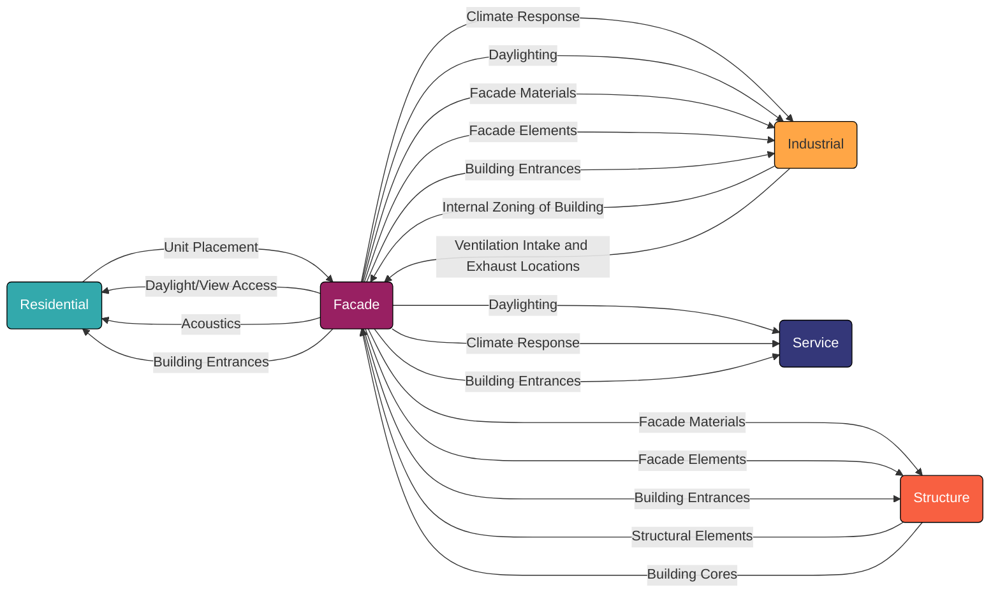

```mermaid
    graph LR
    Residential(Residential) -- Unit Placement ---> Facade(Facade)
    Industrial(Industrial) -- Internal Zoning of Building ---> Facade(Facade)
    Industrial(Industrial) -- Ventilation Intake and Exhaust Locations ---> Facade(Facade)
    Structure(Structure) -- Structural Elements ----> Facade(Facade)
    Structure(Structure) -- Building Cores ----> Facade(Facade)
    Facade(Facade) -- Daylight/View Access ---> Residential(Residential)
    Facade(Facade) -- Acoustics ---> Residential(Residential)
    Facade(Facade) -- Building Entrances ---> Residential(Residential)
    Facade(Facade) -- Climate Response ---> Industrial(Industrial)
    Facade(Facade) -- Daylighting ---> Industrial(Industrial)
    Facade(Facade) -- Facade Materials ---> Industrial(Industrial)
    Facade(Facade) -- Facade Elements ---> Industrial(Industrial)
    Facade(Facade) -- Building Entrances ---> Industrial(Industrial)
    Facade(Facade) -- Facade Materials ---> Structure(Structure)
    Facade(Facade) -- Facade Elements ---> Structure(Structure)
    Facade(Facade) -- Building Entrances ---> Structure(Structure)
    Facade(Facade) -- Daylighting ---> Service(Service)
    Facade(Facade) -- Climate Response ---> Service(Service)
    Facade(Facade) -- Building Entrances ---> Service(Service)

    style Residential fill:#33a9ac, stroke:black, color:#fff
    style Industrial fill:#ffa646, stroke:black
    style Structure fill:#f86041, stroke:black, color:#fff
    style Facade fill:#982062, stroke:black, color:#fff
    style Service fill:#343779, stroke:black, color:#fff
```