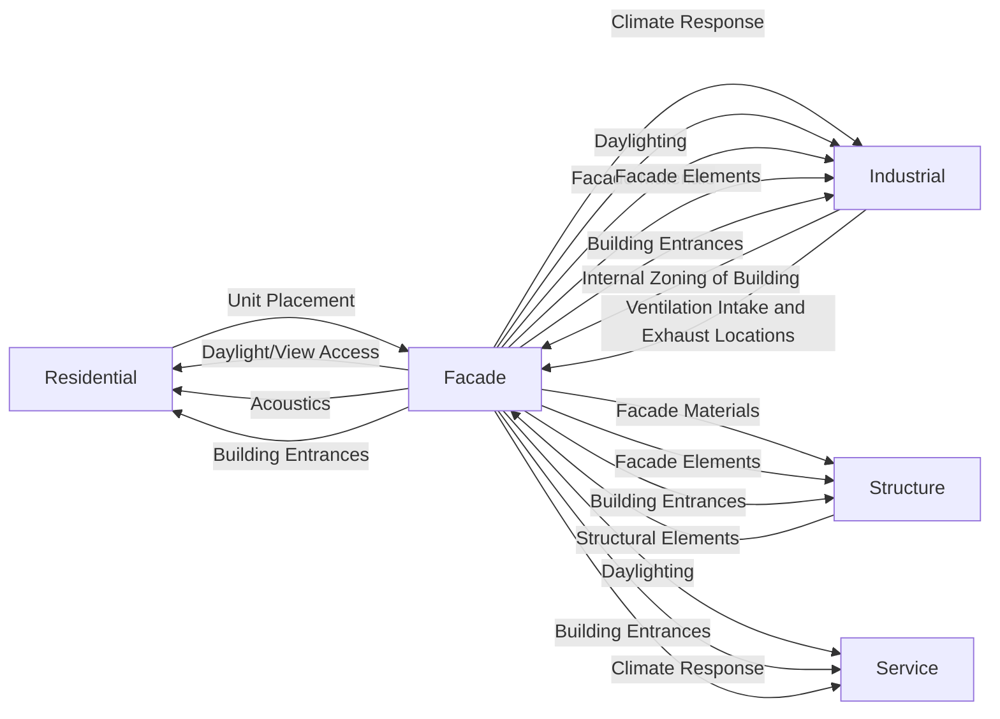

```mermaid
    graph LR
    Residential -- Unit Placement --> Facade
    Industrial -- Internal Zoning of Building --> Facade
    Industrial -- Ventilation Intake and Exhaust Locations --> Facade
    Structure -- Structural Elements --> Facade
    Facade -- Daylight/View Access --> Residential
    Facade -- Acoustics --> Residential
    Facade -- Building Entrances --> Residential
    Facade -- Climate Response --> Industrial
    Facade -- Daylighting --> Industrial
    Facade -- Facade Materials --> Industrial
    Facade -- Facade Elements --> Industrial
    Facade -- Building Entrances --> Industrial
    Facade -- Facade Materials --> Structure
    Facade -- Facade Elements --> Structure
    Facade -- Building Entrances --> Structure
    Facade -- Daylighting --> Service
    Facade -- Climate Response --> Service
    Facade -- Building Entrances --> Service
```