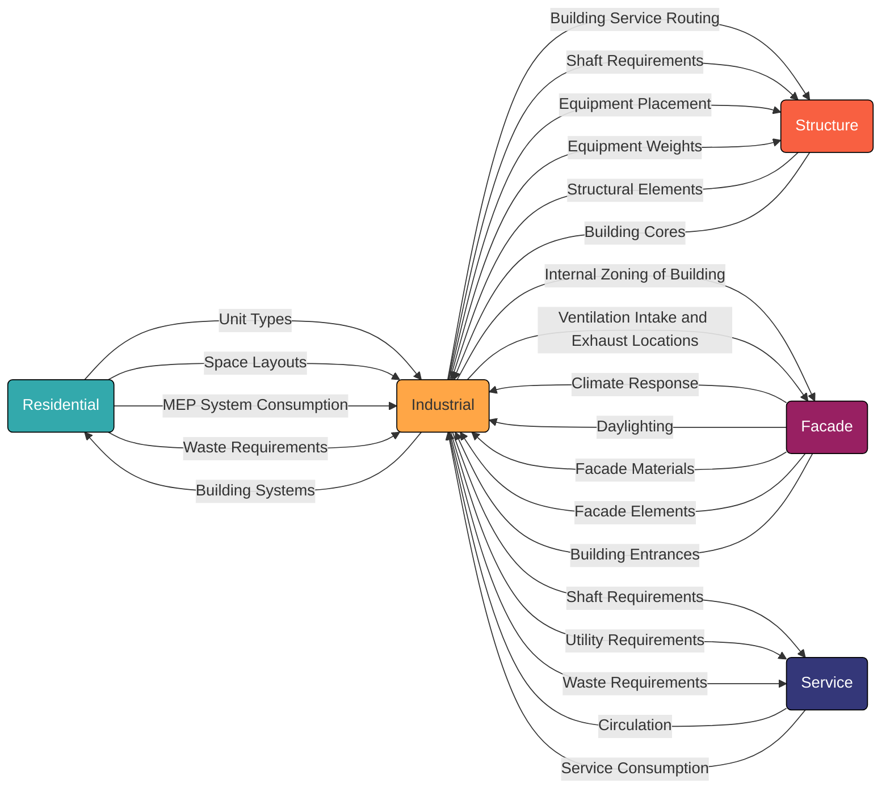

```mermaid
    graph LR
    Residential(Residential) -- Unit Types ---> Industrial(Industrial)
    Residential(Residential) -- Space Layouts ---> Industrial(Industrial)
    Residential(Residential) -- MEP System Consumption ---> Industrial(Industrial)
    Residential(Residential) -- Waste Requirements ---> Industrial(Industrial)
    Industrial(Industrial) -- Building Systems ---> Residential(Residential)
    Industrial(Industrial) -- Building Service Routing ---> Structure(Structure)
    Industrial(Industrial) -- Shaft Requirements ---> Structure(Structure)
    Industrial(Industrial) -- Equipment Placement ---> Structure(Structure)
    Industrial(Industrial) -- Equipment Weights ---> Structure(Structure)
    Industrial(Industrial) -- Internal Zoning of Building ---> Facade(Facade)
    Industrial(Industrial) -- Ventilation Intake and Exhaust Locations ---> Facade(Facade)
    Industrial(Industrial) -- Shaft Requirements ---> Service(Service)
    Industrial(Industrial) -- Utility Requirements ---> Service(Service)
    Industrial(Industrial) -- Waste Requirements ---> Service(Service)
    Structure(Structure) -- Structural Elements ---> Industrial(Industrial)
    Structure(Structure) -- Building Cores ---> Industrial(Industrial)
    Facade(Facade) -- Climate Response ---> Industrial(Industrial)
    Facade(Facade) -- Daylighting ---> Industrial(Industrial)
    Facade(Facade) -- Facade Materials ---> Industrial(Industrial)
    Facade(Facade) -- Facade Elements ---> Industrial(Industrial)
    Facade(Facade) -- Building Entrances ---> Industrial(Industrial)
    Service(Service) -- Circulation ---> Industrial(Industrial)
    Service(Service) -- Service Consumption ---> Industrial(Industrial)

    style Residential fill:#33a9ac, stroke:black, color:#fff
    style Industrial fill:#ffa646, stroke:black
    style Structure fill:#f86041, stroke:black, color:#fff
    style Facade fill:#982062, stroke:black, color:#fff
    style Service fill:#343779, stroke:black, color:#fff
```