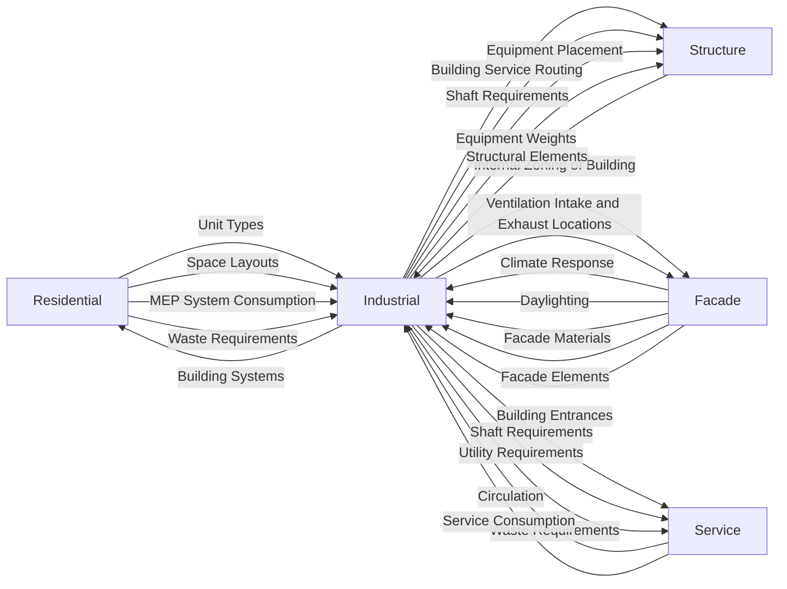

```mermaid
    graph LR
    Residential -- Unit Types --> Industrial
    Residential -- Space Layouts --> Industrial
    Residential -- MEP System Consumption --> Industrial
    Residential -- Waste Requirements --> Industrial
    Industrial -- Building Systems --> Residential
    Industrial -- Building Service Routing --> Structure
    Industrial -- Shaft Requirements --> Structure
    Industrial -- Equipment Placement --> Structure
    Industrial -- Equipment Weights --> Structure
    Industrial -- Internal Zoning of Building --> Facade
    Industrial -- Ventilation Intake and Exhaust Locations --> Facade
    Industrial -- Shaft Requirements --> Service
    Industrial -- Utility Requirements --> Service
    Industrial -- Waste Requirements --> Service
    Structure -- Structural Elements --> Industrial
    Facade -- Climate Response --> Industrial
    Facade -- Daylighting --> Industrial
    Facade -- Facade Materials --> Industrial
    Facade -- Facade Elements --> Industrial
    Facade -- Building Entrances --> Industrial
    Service -- Circulation --> Industrial
    Service -- Service Consumption --> Industrial
```