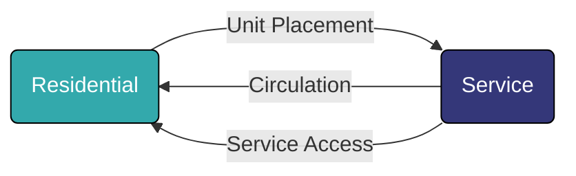

```mermaid
    graph LR
    Residential(Residential) -- Unit Placement ---> Service(Service)
    Service(Service) -- Circulation ---> Residential(Residential)
    Service(Service) -- Service Access ---> Residential(Residential)

    style Residential fill:#33a9ac, stroke:black, color:#fff
    style Service fill:#343779, stroke:black, color:#fff
```