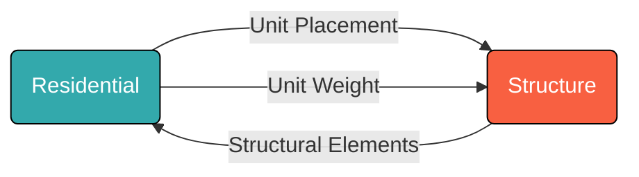

```mermaid
    graph LR
    Residential(Residential) -- Unit Placement ---> Structure(Structure)
    Residential(Residential) -- Unit Weight ---> Structure(Structure)
    Structure(Structure) -- Structural Elements ---> Residential(Residential)

    style Residential fill:#33a9ac, stroke:black, color:#fff
    style Structure fill:#f86041, stroke:black, color:#fff
```