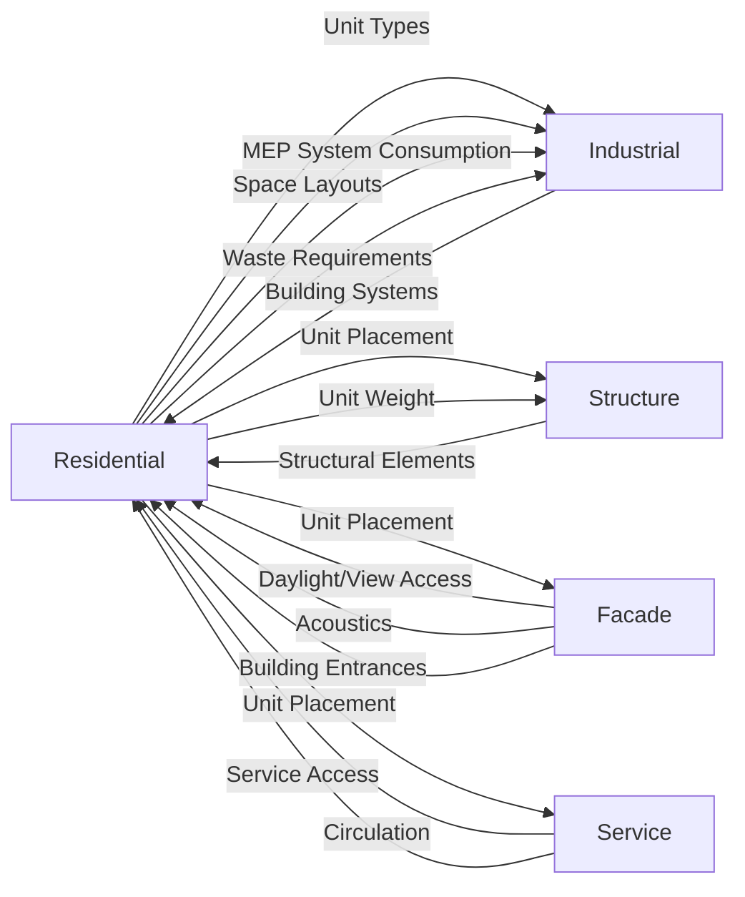

```mermaid
    graph LR
    Residential -- Unit Types --> Industrial
    Residential -- Space Layouts --> Industrial
    Residential -- MEP System Consumption --> Industrial
    Residential -- Waste Requirements --> Industrial
    Residential -- Unit Placement --> Structure
    Residential -- Unit Weight --> Structure
    Residential -- Unit Placement --> Facade
    Residential -- Unit Placement --> Service
    Industrial -- Building Systems --> Residential
    Structure -- Structural Elements --> Residential
    Facade -- Daylight/View Access --> Residential
    Facade -- Acoustics --> Residential
    Facade -- Building Entrances --> Residential
    Service -- Circulation --> Residential
    Service -- Service Access --> Residential
```