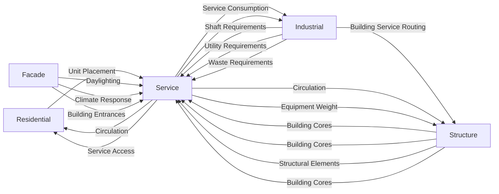

```mermaid
    graph LR
    Residential -- Unit Placement --> Service
    Industrial -- Building Service Routing --> Structure
    Industrial -- Shaft Requirements --> Service
    Industrial -- Utility Requirements --> Service
    Industrial -- Waste Requirements --> Service
    Structure -- Building Cores --> Service
    Structure -- Building Cores --> Service
    Structure -- Structural Elements --> Service
    Structure -- Building Cores --> Service
    Facade -- Daylighting --> Service
    Facade -- Climate Response --> Service
    Facade -- Building Entrances --> Service
    Service -- Circulation --> Residential
    Service -- Service Access --> Residential
    Service -- Circulation --> Industrial
    Service -- Service Consumption --> Industrial
    Service -- Circulation --> Structure
    Service -- Equipment Weight --> Structure
```