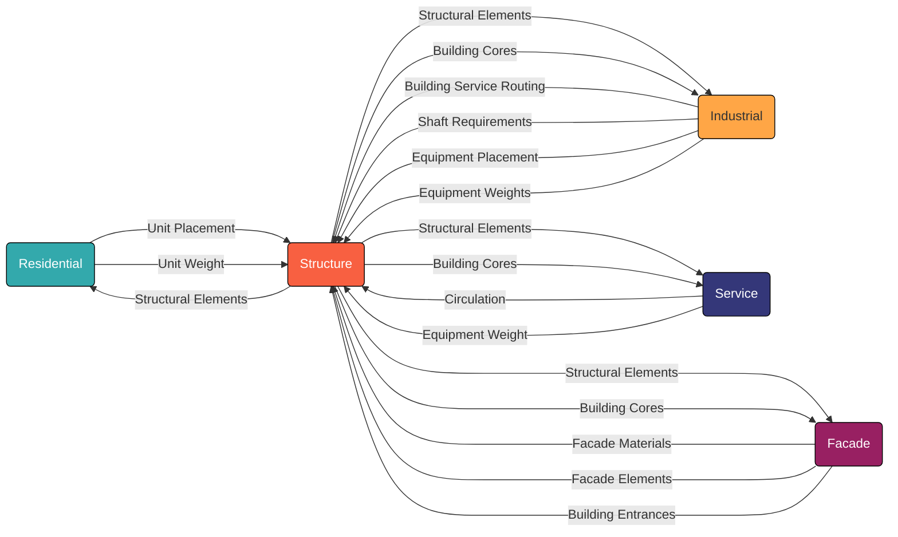

```mermaid
    graph LR
    Residential(Residential) -- Unit Placement ---> Structure(Structure)
    Residential(Residential) -- Unit Weight ---> Structure(Structure)
    Industrial(Industrial) -- Building Service Routing ---> Structure(Structure)
    Industrial(Industrial) -- Shaft Requirements ---> Structure(Structure)
    Industrial(Industrial) -- Equipment Placement ---> Structure(Structure)
    Industrial(Industrial) -- Equipment Weights ---> Structure(Structure)
    Structure(Structure) -- Structural Elements ---> Residential(Residential)
    Structure(Structure) -- Structural Elements ---> Industrial(Industrial)
    Structure(Structure) -- Building Cores ---> Industrial(Industrial)
    Structure(Structure) -- Structural Elements ----> Facade(Facade)
    Structure(Structure) -- Building Cores ----> Facade(Facade)
    Structure(Structure) -- Structural Elements ---> Service(Service)
    Structure(Structure) -- Building Cores ---> Service(Service)
    Facade(Facade) -- Facade Materials ---> Structure(Structure)
    Facade(Facade) -- Facade Elements ---> Structure(Structure)
    Facade(Facade) -- Building Entrances ---> Structure(Structure)
    Service(Service) -- Circulation ---> Structure(Structure)
    Service(Service) -- Equipment Weight ---> Structure(Structure)

    style Residential fill:#33a9ac, stroke:black, color:#fff
    style Industrial fill:#ffa646, stroke:black
    style Structure fill:#f86041, stroke:black, color:#fff
    style Facade fill:#982062, stroke:black, color:#fff
    style Service fill:#343779, stroke:black, color:#fff
```