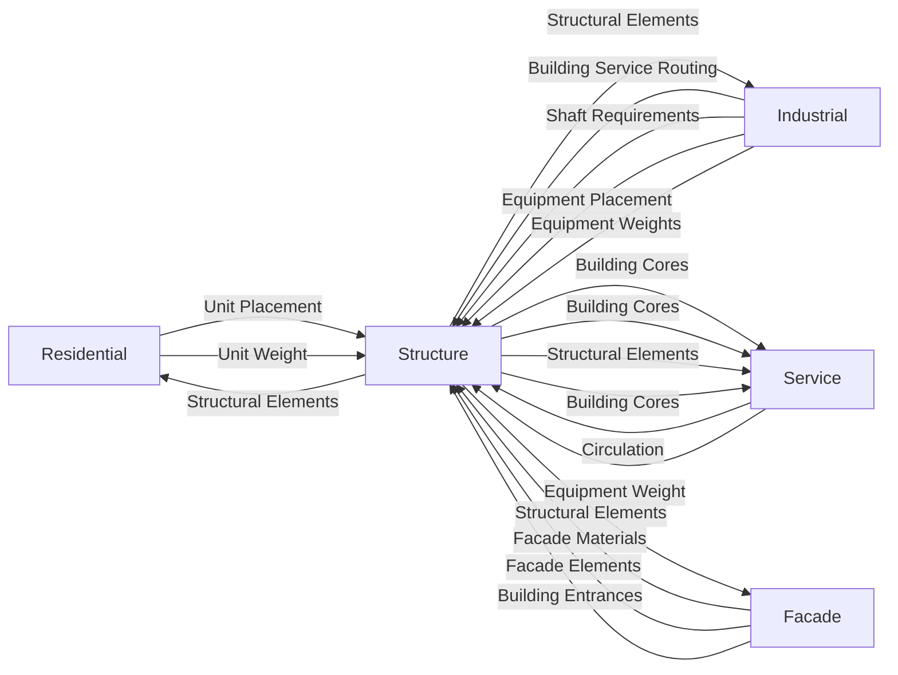

```mermaid
    graph LR
    Residential -- Unit Placement --> Structure
    Residential -- Unit Weight --> Structure
    Industrial -- Building Service Routing --> Structure
    Industrial -- Shaft Requirements --> Structure
    Industrial -- Equipment Placement --> Structure
    Industrial -- Equipment Weights --> Structure
    Structure -- Structural Elements --> Residential
    Structure -- Structural Elements --> Industrial
    Structure -- Building Cores --> Service
    Structure -- Structural Elements --> Facade
    Structure -- Building Cores --> Service
    Structure -- Structural Elements --> Service
    Structure -- Building Cores --> Service
    Facade -- Facade Materials --> Structure
    Facade -- Facade Elements --> Structure
    Facade -- Building Entrances --> Structure
    Service -- Circulation --> Structure
    Service -- Equipment Weight --> Structure
```