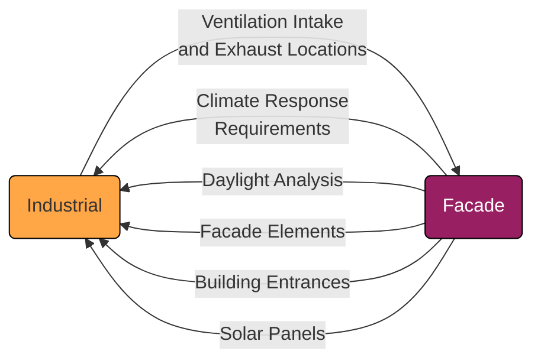

```mermaid
    graph LR
    Industrial(Industrial) -- Ventilation Intake <br>and Exhaust Locations ---> Facade(Facade)
    Facade(Facade) -- Climate Response<br>Requirements ---> Industrial(Industrial)
    Facade(Facade) -- Daylight Analysis ---> Industrial(Industrial)
    Facade(Facade) -- Facade Elements ---> Industrial(Industrial)
    Facade(Facade) -- Building Entrances ---> Industrial(Industrial)
    Facade(Facade) -- Solar Panels ---> Industrial(Industrial)

    style Industrial fill:#ffa646, stroke:black
    style Facade fill:#982062, stroke:black, color:#fff
```