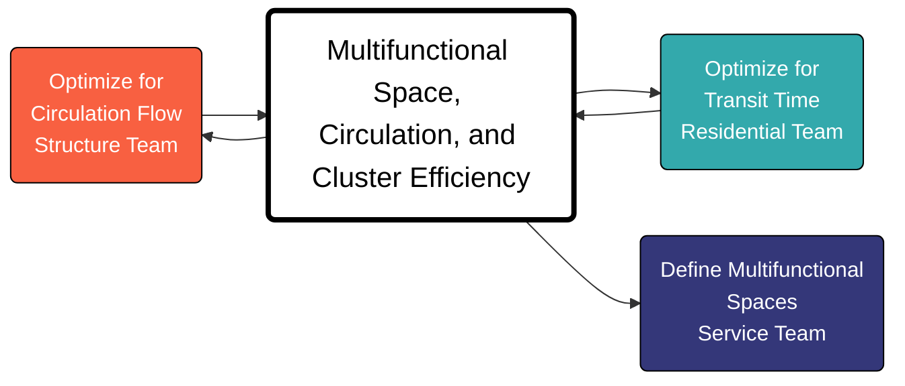

```mermaid
    graph LR

    Structure(Optimize for <br>Circulation Flow<br>Structure Team)
    Residential(Optimize for <br>Transit Time<br>Residential Team)
    Service(Define Multifunctional <br>Spaces<br>Service Team)
    Concept(Multifunctional Space, <br>Circulation, and <br>Cluster Efficiency)

    Structure --> Concept
    Residential --> Concept

    Concept --> Structure
    Concept --> Residential
    Concept --> Service

    style Structure fill:#f86041, stroke:black, color:#fff
    style Residential fill:#33a9ac, stroke:black, color:#fff
    style Service fill:#343779, stroke:black, color:#fff
    style Concept fill:#fff, stroke:black, color:#000, stroke-width:4px, font-size:16pt
```
