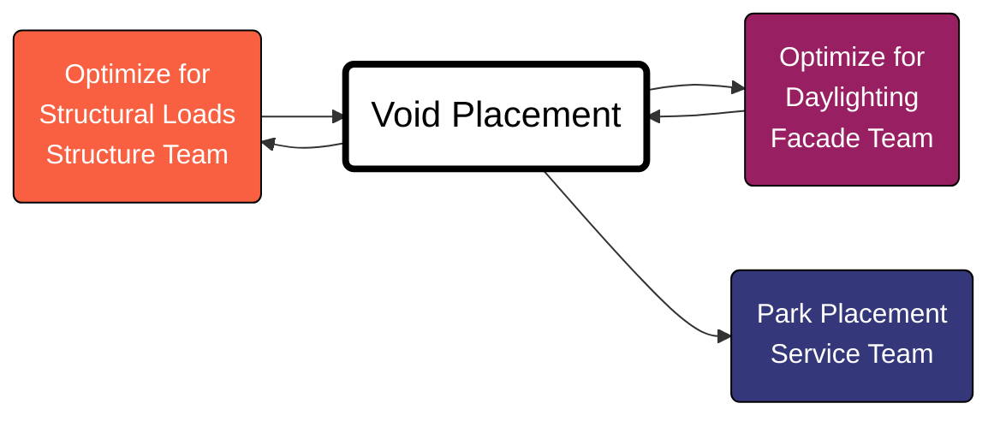

```mermaid
    graph LR

    Structure(Optimize for <br>Structural Loads<br>Structure Team)
    Concept(Void Placement)
    Facade(Optimize for <br>Daylighting<br>Facade Team)
    Service(Park Placement<br>Service Team)

    Structure --> Concept
    Facade --> Concept

    Concept --> Structure
    Concept --> Facade

    Concept --> Service

    style Structure fill:#f86041, stroke:black, color:#fff
    style Facade fill:#982062, stroke:black, color:#fff
    style Service fill:#343779, stroke:black, color:#fff
    style Concept fill:#fff, stroke:black, color:#000, stroke-width:4px, font-size:16pt

```
