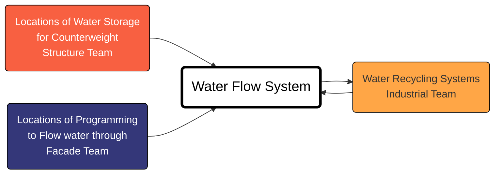

```mermaid
    graph LR

    Structure(Locations of Water Storage<br>for Counterweight<br>Structure Team)
    Concept(Water Flow System)
    Service(Locations of Programming<br>to Flow water through<br>Facade Team)
    Industrial(Water Recycling Systems<br>Industrial Team)

    Structure --> Concept
    Service --> Concept

    Concept --> Industrial
    Industrial --> Concept

    style Industrial fill:#ffa646, stroke:black
    style Structure fill:#f86041, stroke:black, color:#fff
    style Service fill:#343779, stroke:black, color:#fff
    style Concept fill:#fff, stroke:black, color:#000, stroke-width:4px, font-size:16pt

```
