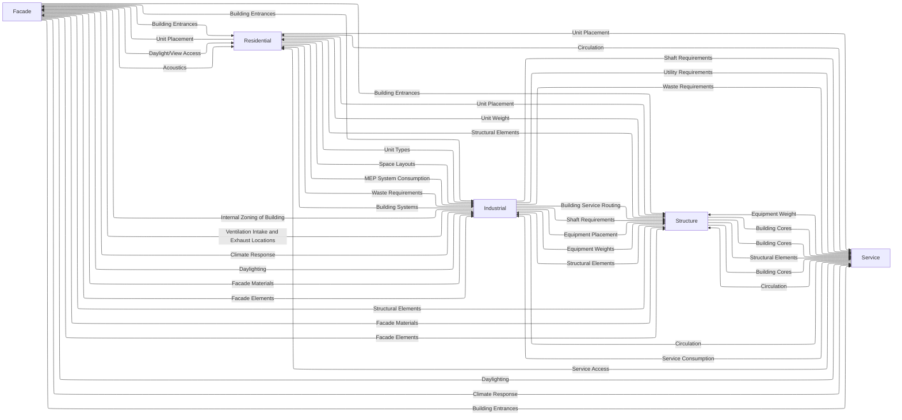

# Hyper Building A

## Teams

### Team 1 Residential

> Designing Program for Living Spaces

Amira El Saeed
Mohammed Attay
Aleyna Kircali

### Team 2 Industrial

> Placeholder

Aymeric Brouez 
Cesar Herbosa
Andres Espinosa

### Team 3 Structure 
> Load-bearing systems and vertical circulation.

Marco Durand
Filippo Batavia
Joaquin Broquedis

### Team 4 Facade

> External skin, shading systems, and energy performance.

Andrea Ardizzi
Giulia Tortorella
Christina Chistoforou

### Team 5 Service

> Building Support Services 

Seda Soylu
Matea Pinjusic
Francesco Visconti

### Team 7 Data

> Focused on creating and managing the data architecture, ensuring seamless integration and collaboration across all components.

Mahnoor Fatima
Biel Pitman
Scott Lebow

## Week 1 Initial Research

### Links

- https://speckle.guide/user/concepts.html
- https://speckle.guide/user/concepts-advanced.html#speckle-kits-%F0%9F%94%80
- https://speckle.community/t/introducing-kits-2-0/710
- https://www.speckle.systems/case-studies/the-importance-of-giving-your-data-meaning
- https://web.archive.org/web/20240916150635/
- https://speckle.systems/blog/what-is-your-data-strategy/
- https://www.speckle.systems/tutorials/create-your-first-speckle-app-using-only-python

### Projects

"Projects are the main mechanism by which data is shared between people and applications. For example, you could create a project in Revit and send that data to your server."

### Models

"Models give you an extra layer of organisation within a project. Speckle users frequently use models to carry out parallel studies / design options., define different disciplines, or to separate out different parts of a project that may represent different responsibilities or ownership."

#### Models for Hyper Building A?

- One for each Team.
- Potentially also submodels inside each team
    - Will need to discuss with each team
- Model to house basic information about Hyper building 2
    - Building Mass
    - Location on site

### Versions

We must require version messages with all pushes. Similar to git commits.

### The Base Object

"The Base object is the building block of Speckle data. It is a dynamic object that is the "base" of all other Speckle objects."

### Speckle Kits

"Speckle kits are custom translators to get data to (and from) Speckle's native object model."

## Bigger Ideas
### Model to Model Data Transfer Standards
There will be two sets of data inside each team's model.
1. Data that is internal to that team
2. Data that is coordinated with external teams

External Coordination Data will need to be regulated by the Data Team to meet certain standards. 

#### Parameter Definition
For each parameter we will need to define:

1. Name
1. Data Type: int, float, string, etc.
1. Owner: Which team updates this parameter
1. Recipient: Which team(s) is/are receiving this parameter
1. Reason: Why is this parameter important 
1. Dependency: What does it rely on

### Miro Board
Consider a Miro board for the full project
Consider a separate Miro board for each Team

### Hyper Building A to Hyper Building B
Define a limited set of goals for each building.  
Ensure each building does not negatively impact the goals of the other building. 
For example, if daylighting is the goal for building A, building B should not shade that building.

## Full Chart

# Team InterWork

## Closely Aligned Teams
Industrial and Service
Structure and Industrial
Facade and Structural
Facade and Residential
