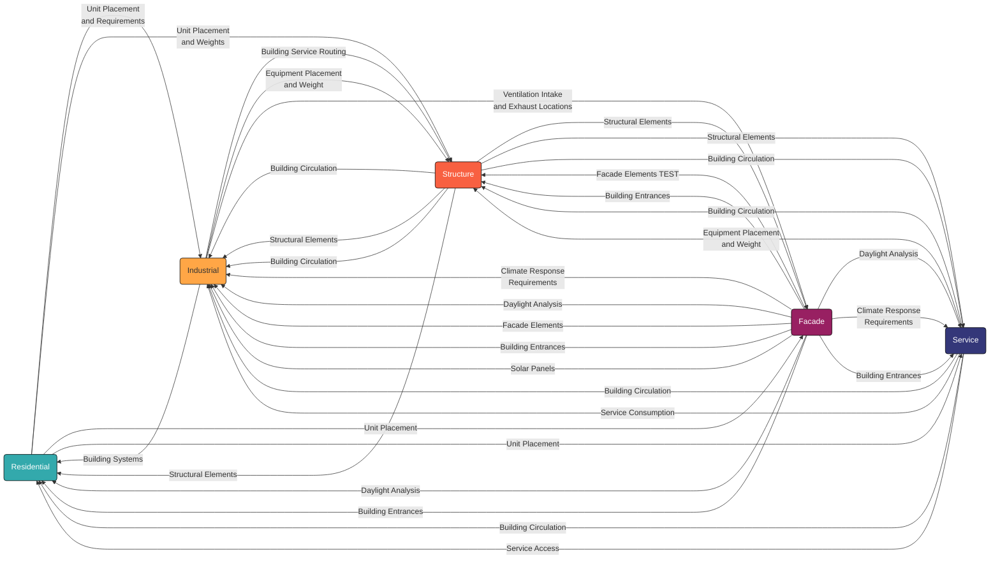
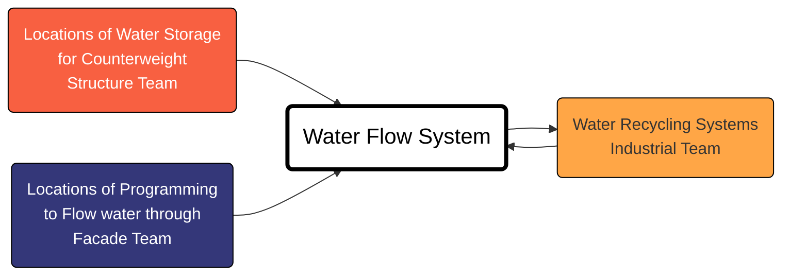
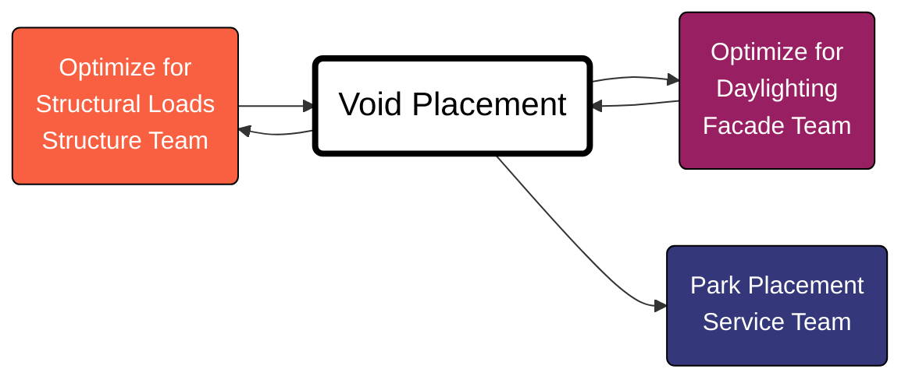
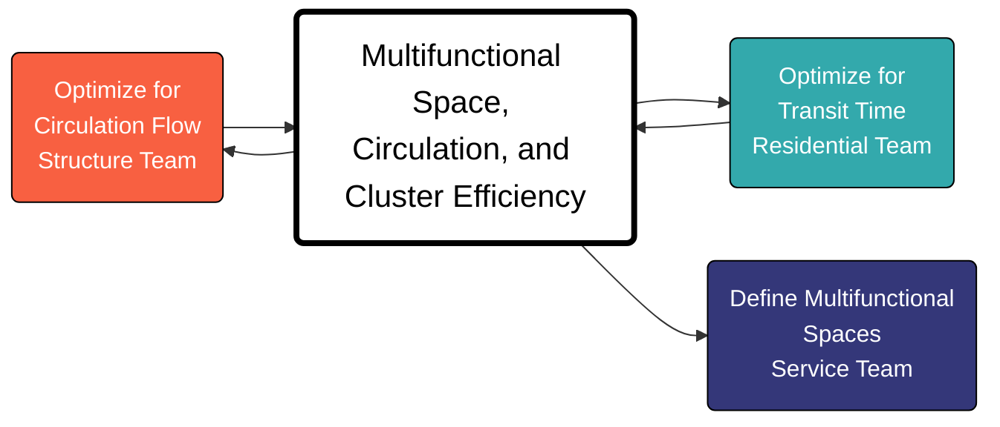

<style>
h1 {
    font-family: 'Roboto Mono', monospace;
}
h2 {
    font-family: 'Roboto Mono', monospace;
}
h3 {
    font-family: 'Roboto Mono', monospace;
}
h4 {
    font-family: 'Roboto Mono', monospace;
}
p {
    font-family: 'Roboto Mono', monospace;
}
li {
    font-family: 'Roboto Mono', monospace;
}
</style>

# Hyper Building A

## Teams

### Team 1 Residential
> Designing Program for Living Spaces

Amira El Saeed
Mohammed Attay
Aleyna Kircali

Concept:
15 minute city.  Goal is to make sure we have a maximum distance to ammenities from each residential unit.  Using cluster algorithms.  

Currently working on cluster arrangement algorithms.

### Team 2 Industrial

> Placeholder

Aymeric Brouez 
Cesar Herbosa
Andres Espinosa

Concept:
We reduce down to three main topics, energy, water and waste.  Aiming for not net-zero but self-sufficiency 2x.  From the waste part it's zero-waste development, connecting to city for wastewater.  Trying to hide the existing wastewater plant.  Trying to clean the waste from neighbors.

About food, targetting a vegetarian + fish + chicken / eggs.  Self sufficient using waste that is recycling.  May use parks as food production and also lesuire.  Want to work with Residential Team.

### Team 3 Structure 
> Load-bearing systems and vertical circulation.

Marco Durand
Filippo Batavia
Joaquin Broquedis

Concept:
Want to focus on Flow through the building.  Want to provide flexibility and easier to collaborate.  Also to allow the building functions to change through the life of the building.  Main metric, greater slab total area vs smallest structural element area.  Want to combine vertical cores and horizontal circulation into diagonal "cores" with junctions.  Junctions could serve as centers of districts and mobility hubs.  

Also want to keep ground floor elevated to allow connection to urban flow.  We want to make this structural system as flexible as possible.  Rather than a fixed structure, we could take a 3D topological map based on which programs need to be connected and translate that into a structural diagram.  

Flow of forces and follow circulation through the main building, and exoskeleton to handle torsion and seismic activity.  Also consider the flow of water through the buidling, collect water on roof and store as seismic dampers.  Then flow the water through the building to serve other functions, like food production.

They will be taking some space from the water treatment plant, want to integrate the plant into the building's water use.  Could have flowing water / waterfalls through offices, or ponds / fountains in parks.  

Thinking about a network of voids and negative space to serve green space and provide daylight.

### Team 4 Facade

> External skin, shading systems, and energy performance.

Andrea Ardizzi
Giulia Tortorella
Christina Chistoforou

Concept:
Started with climate analysis on a box building.  Start to make the framework so we can test different iterations of the facade.  We've run some analysis and want to avoid being an obstacle to the other buildings.  Want to test how the winter solstice effects the building.

They've tested the maximum mass of 1M sqm filling the entire site.  If we don't want to be an obstacle, this is the largest we can be.  

Ratio between void space and building space has impact on the volume.  

Primary metric, maximize view exposure and minimize sun exposure.  Testing different shapes of facade panels, goal of using a single panel.  Secondary metric is radiance.  Adaptive ideas, not high tech.  Perhaps also thinking about solar panel integration in the facade.

Will have to choose where on the massing we will place kinetic facade or solar panels.  Will place one or the other at any location.

How does the shape of the building come in this project?

### Team 5 Service

> Building Support Services 

Seda Soylu
Matea Pinjusic
Francesco Visconti

Concept: 
Functions placed in the building are based on the time usage of the day.  Some uses are more morning, others are more evening / night.  How many hours is a space used?  Need multifunctional spaces that can be used different times of the day for different uses.  Some cannot be multifunction but others can.

Also explore use of space for different times of the year.  For example, student housing would be primarily used during schoolyear.  

Want to also explore the use of mobility.  Maybe not all the mobility should be electricity driven.  Should have parts of the building where you can walk or ride a bike.  Maybe gravity solutions like slides or rails.

Need to determine the topological map for the building.  Detemine types of neighborhoods.  

Microclimate inside the building.  Use aspects of other team concepts to define the climates.  

### Team 7 Data

> Focused on creating and managing the data architecture, ensuring seamless integration and collaboration across all components.

Mahnoor Fatima
Biel Pitman
Scott Lebow

## Week 1 Initial Research

### Links

- https://speckle.guide/user/concepts.html
- https://speckle.guide/user/concepts-advanced.html#speckle-kits-%F0%9F%94%80
- https://speckle.community/t/introducing-kits-2-0/710
- https://www.speckle.systems/case-studies/the-importance-of-giving-your-data-meaning
- https://web.archive.org/web/20240916150635/
- https://speckle.systems/blog/what-is-your-data-strategy/
- https://www.speckle.systems/tutorials/create-your-first-speckle-app-using-only-python

### Projects

"Projects are the main mechanism by which data is shared between people and applications. For example, you could create a project in Revit and send that data to your server."

### Models

"Models give you an extra layer of organisation within a project. Speckle users frequently use models to carry out parallel studies / design options., define different disciplines, or to separate out different parts of a project that may represent different responsibilities or ownership."


#### Models for Hyper Building A?

- One for each Team.
- Potentially also submodels inside each team
    - Will need to discuss with each team
- Model to house basic information about Hyper building 2
    - Building Mass
    - Location on site

### Versions

We must require version messages with all pushes. Similar to git commits.

### The Base Object

"The Base object is the building block of Speckle data. It is a dynamic object that is the "base" of all other Speckle objects."

### Speckle Kits

"Speckle kits are custom translators to get data to (and from) Speckle's native object model."

## Bigger Ideas
### Model to Model Data Transfer Standards
There will be two sets of data inside each team's model.
1. Data that is internal to that team
2. Data that is coordinated with external teams

External Coordination Data will need to be regulated by the Data Team to meet certain standards. 

#### Parameter Definition
For each parameter we will need to define:

1. Name
1. Data Type: int, float, string, etc.
1. Owner: Which team updates this parameter
1. Recipient: Which team(s) is/are receiving this parameter
1. Reason: Why is this parameter important 
1. Dependency: What does it rely on

### Miro Board
Consider a Miro board for the full project
Consider a separate Miro board for each Team

### Hyper Building A to Hyper Building B
Define a limited set of goals for each building.  
Ensure each building does not negatively impact the goals of the other building. 
For example, if daylighting is the goal for building A, building B should not shade that building.

## Full Chart



# Team InterWork

## Closely Aligned Teams
Industrial and Service
Structure and Industrial
Facade and Structural
Facade and Residential

# Week 2 Friday Meeting

## Building Mass
Need to generate an initial building mass to start considering different criterea.
Data Team to create a list of inputs that will contrain the building mass.

## Topological Map
Need to generate a program map for the building.  Data Team will overlap ideas from each concept based on meeting notes.

## Connection To Building B
Need to observe building B's concept and find needs to connect them.

## Monday Presentation
Each team presents a single concept of their portion of the design.
Have ChatGPT combine these into a single vision of the building.
Have a single side presenting a concept for the entire building.  

# Strong Concept Scope Overlaps

## Water Flow
### Industrial, Service and Structure
Both teams seek to design a water system that flows through the building for multiple uses.



## Void Placement
### Structure and Facade -> Services
Structure has highlighted void placement in the building form and Facade has highlighting daylight.  Void's can be designed to maximize daylighting and provide Structural load bearing.  

Services team can use the void placement as an input to locate parks.



## Multifunctional Space, Circulation and Cluster Efficiency
### Residential, Structure and Service

The Service Team’s focus on multifunctional spaces and daily mobility integration (walking, biking, gravity solutions) overlaps strongly with the Structural Team’s flexible structural designs and focus on circulation flow and with Residential Team's goal of minimizing transit time to amenities. Together, they can create adaptive spaces that evolve based on time-of-day and season.



## Self-sufficiency and Reuse / Recycling

Many teams indicated a goal of designing a building that is not a drain on external resources and instead seeks to be efficient with local resources.   

# Metrics

## <span style="background-color: #FFA646">Industrial </span>Team:

**Primary Metric:** Energy Self-sufficiency Ratio

**Normalized Value:** 
``` math
    \frac {Energy Generation}{Energy Demand}
```

**Secondary Metric:** Food Self-sufficiency Ratio

**Normalized Value:** 
``` math
    \frac {Food Production}{Food Demand}
```

**Secondary Metric:** Recycled Water Ratio

**Normalized Value:** 
``` math
    \frac {Recycled Water}{Wastewater Production}
```

**Secondary Metric:** Solid Waste Utilization Ratio

**Normalized Value:** 
``` math
    \frac {Recycled Solid Waste}{Solid Waste Production}
```

## <span style="background-color: #982062; color: white">Facade </span>Team:

**Primary Metric:** Primary Daylight Factor & and Solar Loads Control for Residential Spaces and Work Spaces

**Normalized Value:** Combined Metric

```math
    weight_{residential} * \frac{ResidentialAreaWithDaylight}{TotalResidentialArea} + weight_{work} * \frac{WorkAreaWithDaylight}{TotalWorkArea} * \frac{10}{7}
```

**Secondary Metric:** Panel Optimization

**Normalized Value:** 
``` math
    \frac {Total Final Panel Area}{Total Initial Panel Area}
```

**Secondary Metric:** Target Energy Generation Ratio

**Normalized Value:** 
``` math
    \frac {Energy Generation}{Energy Required By Industrial Team}
```

## <span style="background-color: #33a9ac; color: white">Residential </span>Team:

**Primary Metric:** Index of Mixed-Use

**Normalized Value:** 
``` math
    1-\frac{\sum{Number Of Units Of A Single Function_i (Number Of Units Of A Single Function_i - 1)}}{Total Number Of Units * (Total Number Of Units - 1)}
```
Goal to be between 0.6 and 0.8.

## <span style="background-color: #343779; color: white">Service </span>Team:

**Primary Metric:**  Theoretical 24/7 Occupancy Efficiency Formula

**Normalized Value:** 
``` math
    \frac {\sum_{i-1}^{n} (Utilization Rate Of Function _i * Active Hours Of Function Per Day_i * FunctionExchangeFactor_i)}{Total Available Hours Per Day * Total Spaces Available}
```
Where i is each function in the building.
<br>

## <span style="background-color: #F86041; color: white">Structure </span>Team:

**Primary Metric:** Floor Flexibility: Column-Free Floor Area Ratio

**Normalized Value:** 
``` math
    \frac {Total ColumnFree Floor Area}{Total Floor Area}
```
With established comparison cases based on industry standards.

**Secondary Metric:** Structural Efficiency: Embodied Carbon Efficiency

**Normalized Value:** 
``` math
    \frac {Total Embodied Carbon Emissions}{Usable Floor Area}
```

**Secondary Metric:** Structural Efficiency: Structural Efficiency Rating

**Normalized Value:** 
``` math
    \frac {Load Capacity}{Self Weight Of Structure}
```
Existing Metric from the Structural Engineering Industry.

**Secondary Metric:** Structural Efficiency: Material Efficiency Ratio

**Normalized Value:** 
``` math
    \frac {Theoretical Minimum Material Usage}{Actual Material Usage}
```
Karamba3D Analysis

# Week 3 Data Team Meeting

## Data Sharing
Ways to share GH Files on Google Drive.  
Data Input/Output Nodes
    Option 1: Share ghdata file separately from speckle over gdrive
    Option 2: We output the gh data into speckle parameters
Share the ghdata files also on drive

## Dashboard

